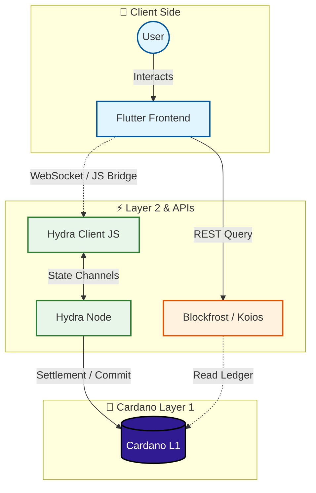
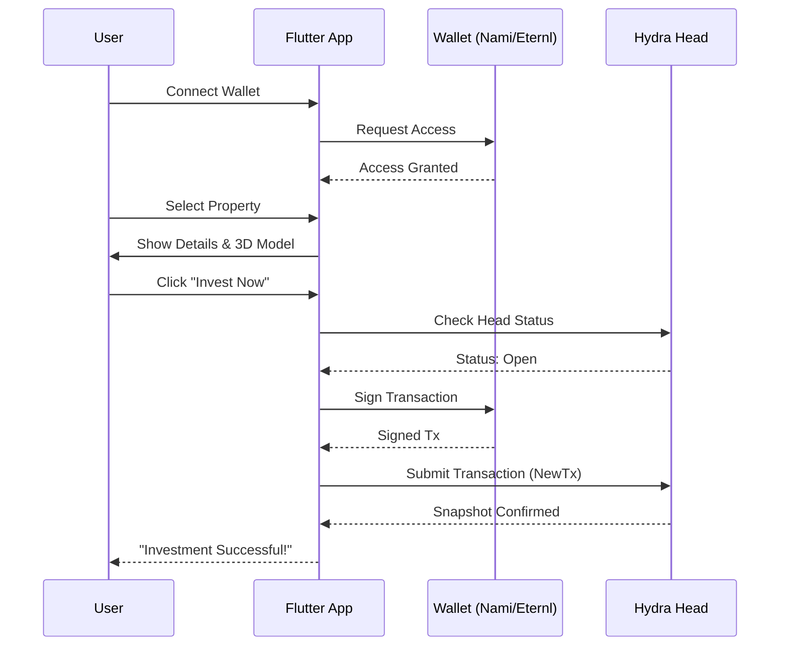
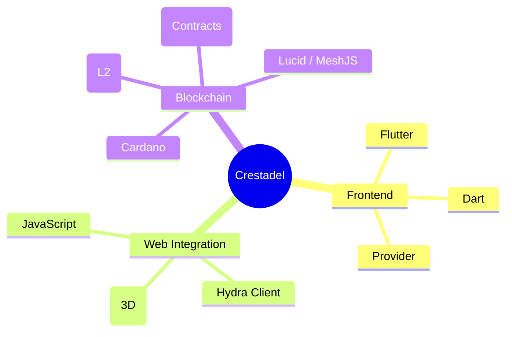
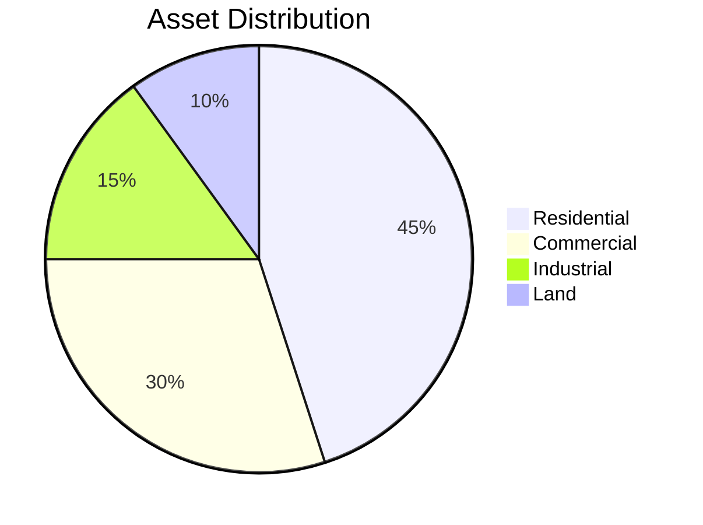

# 🏙️ Crestadel

**Real World Asset Tokenization on Cardano**

Crestadel is a cutting-edge decentralized application (DApp) that bridges the gap between real estate and blockchain technology. Built on **Cardano** and leveraging **Hydra** for Layer 2 scaling, Crestadel allows users to invest in fractionalized real estate assets with near-instant settlement and negligible fees.

---
Click the link below to watch the demo:
[**▶️ Watch the Crestadel Walkthrough**](https://github.com/soulcloude00/crestadel/blob/main/Video%20Demonstration/VN20251130_113955.mp4)

## 🏗️ Architecture

The system utilizes a hybrid architecture to ensure scalability and security.



---

## 🚀 User Journey: Investment Flow

Experience a seamless investment process from wallet connection to asset ownership.



---

## 🛠️ Tech Stack



---

## ✨ Key Features

-   **Fractional Ownership**: Buy and sell fractions of high-value real estate.
-   **Hydra Powered**: Lightning-fast transactions using Cardano's L2 scaling solution.
-   **3D Virtual Tours**: Interactive 3D models of properties directly in the app.
-   **Secure Wallet Integration**: Seamless connection with Nami, Eternl, and other Cardano wallets.
-   **Real-time Trading**: Trade property tokens instantly within open Hydra Heads.

---

## 📊 Tokenomics (Example)



---

## 🚦 Getting Started

1.  **Prerequisites**:
    -   Flutter SDK
    -   Cardano Wallet (Nami/Eternl)
    -   Running Hydra Node (for L2 features)

2.  **Installation**:
    ```bash
    git clone https://github.com/soulcloude00/dapp.git
    cd frontend
    flutter pub get
    ```

3.  **Run**:
    ```bash
    flutter run -d chrome
    ```
