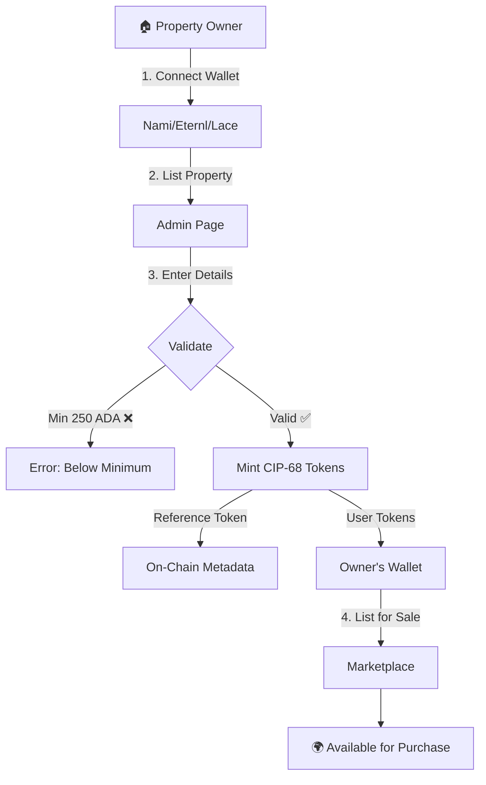
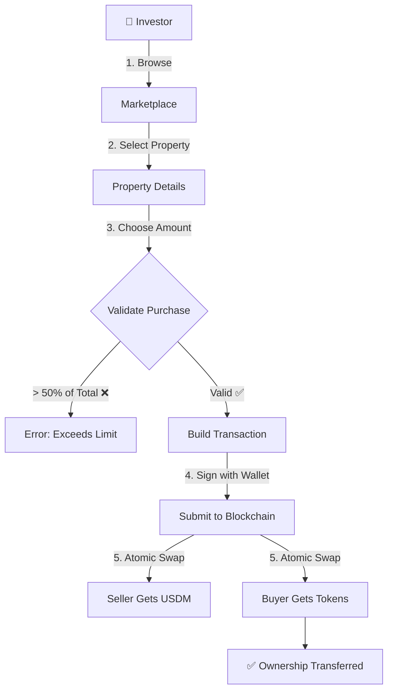
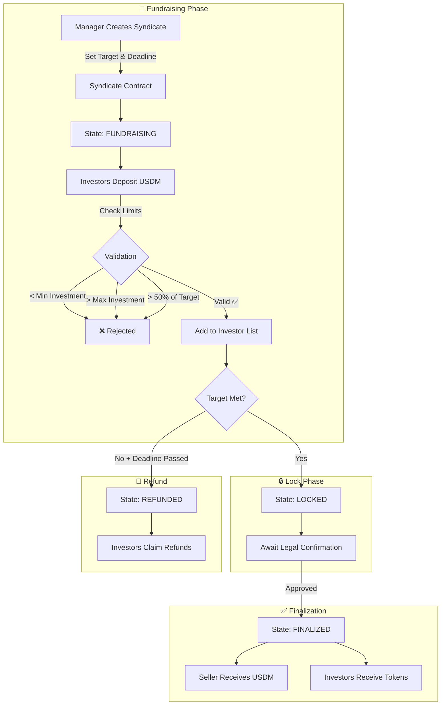
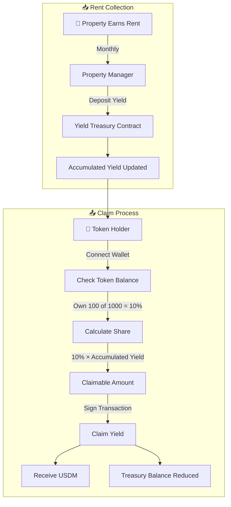
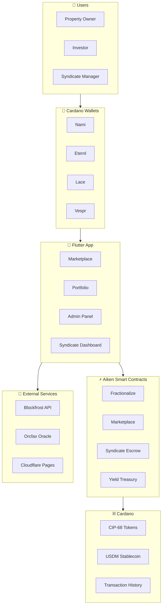
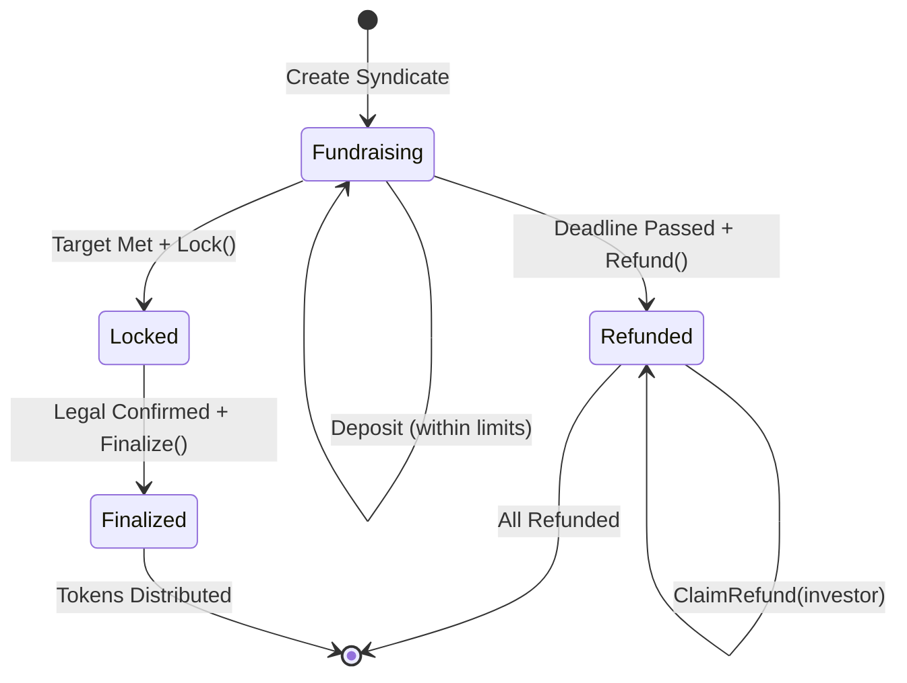
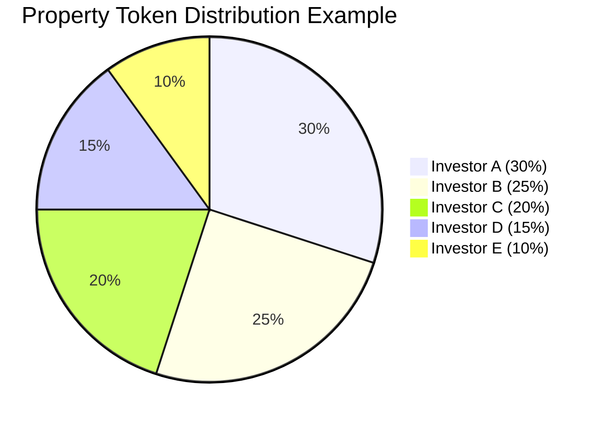
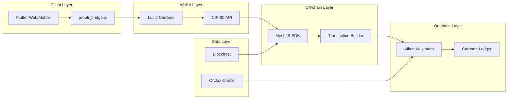

# Crestadel - User Flow Diagrams

## 1. Property Fractionalization Flow

## 2. Fractional Investment Flow

## 3. Syndicate Crowdfunding Flow

## 4. Yield Distribution Flow

## 5. Complete Platform Overview

## 6. State Machine Diagram

## 7. Token Economics

## 8. Technology Stack Flow

---

## Quick Reference

| Action | Contract | Redeemer | State Change |
|--------|----------|----------|--------------|
| List Property | Fractionalize | MintFractions | → Minted |
| Buy Fraction | Marketplace | Buy | → Sold |
| Create Syndicate | Syndicate | - | → Fundraising |
| Invest | Syndicate | Deposit{amount} | Fundraising |
| Lock Funds | Syndicate | Lock | Fundraising → Locked |
| Complete Purchase | Syndicate | Finalize | Locked → Finalized |
| Request Refund | Syndicate | Refund | Fundraising → Refunded |
| Claim Refund | Syndicate | ClaimRefund{investor} | Refunded |
| Deposit Rent | Yield | DepositYield{amount} | +Yield |
| Claim Rent | Yield | ClaimYield{holder,amount} | -Yield |
