# Crestadel - User Flow Diagrams

## 1. Property Fractionalization Flow

```mermaid
flowchart TD
    A[🏠 Property Owner] -->|1. Connect Wallet| B[Nami/Eternl/Lace]
    B -->|2. List Property| C[Admin Page]
    C -->|3. Enter Details| D{Validate}
    D -->|Min 250 ADA ❌| E[Error: Below Minimum]
    D -->|Valid ✅| F[Mint CIP-68 Tokens]
    F -->|Reference Token| G[On-Chain Metadata]
    F -->|User Tokens| H[Owner's Wallet]
    H -->|4. List for Sale| I[Marketplace]
    I --> J[🌍 Available for Purchase]
```

## 2. Fractional Investment Flow

```mermaid
flowchart TD
    A[👤 Investor] -->|1. Browse| B[Marketplace]
    B -->|2. Select Property| C[Property Details]
    C -->|3. Choose Amount| D{Validate Purchase}
    D -->|> 50% of Total ❌| E[Error: Exceeds Limit]
    D -->|Valid ✅| F[Build Transaction]
    F -->|4. Sign with Wallet| G[Submit to Blockchain]
    G -->|5. Atomic Swap| H[Seller Gets USDM]
    G -->|5. Atomic Swap| I[Buyer Gets Tokens]
    I --> J[✅ Ownership Transferred]
```

## 3. Syndicate Crowdfunding Flow

```mermaid
flowchart TD
    subgraph Phase1[🚀 Fundraising Phase]
        A[Manager Creates Syndicate] -->|Set Target & Deadline| B[Syndicate Contract]
        B --> C[State: FUNDRAISING]
        C --> D[Investors Deposit USDM]
        D -->|Check Limits| E{Validation}
        E -->|< Min Investment| F[❌ Rejected]
        E -->|> Max Investment| F
        E -->|> 50% of Target| F
        E -->|Valid ✅| G[Add to Investor List]
        G --> H{Target Met?}
    end
    
    subgraph Phase2[🔒 Lock Phase]
        H -->|Yes| I[State: LOCKED]
        I --> J[Await Legal Confirmation]
    end
    
    subgraph Phase3A[✅ Finalization]
        J -->|Approved| K[State: FINALIZED]
        K --> L[Seller Receives USDM]
        K --> M[Investors Receive Tokens]
    end
    
    subgraph Phase3B[💸 Refund]
        H -->|No + Deadline Passed| N[State: REFUNDED]
        N --> O[Investors Claim Refunds]
    end
```

## 4. Yield Distribution Flow

```mermaid
flowchart TD
    subgraph Collection[📥 Rent Collection]
        A[🏢 Property Earns Rent] -->|Monthly| B[Property Manager]
        B -->|Deposit Yield| C[Yield Treasury Contract]
        C --> D[Accumulated Yield Updated]
    end
    
    subgraph Distribution[📤 Claim Process]
        E[👤 Token Holder] -->|Connect Wallet| F[Check Token Balance]
        F -->|Own 100 of 1000 = 10%| G[Calculate Share]
        G -->|10% × Accumulated Yield| H[Claimable Amount]
        H -->|Sign Transaction| I[Claim Yield]
        I --> J[Receive USDM]
        I --> K[Treasury Balance Reduced]
    end
    
    D --> E
```

## 5. Complete Platform Overview

```mermaid
flowchart TB
    subgraph Users[👥 Users]
        U1[Property Owner]
        U2[Investor]
        U3[Syndicate Manager]
    end
    
    subgraph Wallets[🔐 Cardano Wallets]
        W1[Nami]
        W2[Eternl]
        W3[Lace]
        W4[Vespr]
    end
    
    subgraph Frontend[📱 Flutter App]
        F1[Marketplace]
        F2[Portfolio]
        F3[Admin Panel]
        F4[Syndicate Dashboard]
    end
    
    subgraph Contracts[⚡ Aiken Smart Contracts]
        C1[Fractionalize]
        C2[Marketplace]
        C3[Syndicate Escrow]
        C4[Yield Treasury]
    end
    
    subgraph Blockchain[⛓️ Cardano]
        B1[CIP-68 Tokens]
        B2[USDM Stablecoin]
        B3[Transaction History]
    end
    
    subgraph Services[🔧 External Services]
        S1[Blockfrost API]
        S2[Orcfax Oracle]
        S3[Cloudflare Pages]
    end
    
    Users --> Wallets
    Wallets --> Frontend
    Frontend --> Contracts
    Contracts --> Blockchain
    Frontend --> Services
```

## 6. State Machine Diagram

## 7. Token Economics

## 8. Technology Stack Flow

---

## Quick Reference

| Action | Contract | Redeemer | State Change |
|--------|----------|----------|--------------|
| List Property | Fractionalize | MintFractions | → Minted |
| Buy Fraction | Marketplace | Buy | → Sold |
| Create Syndicate | Syndicate | - | → Fundraising |
| Invest | Syndicate | Deposit{amount} | Fundraising |
| Lock Funds | Syndicate | Lock | Fundraising → Locked |
| Complete Purchase | Syndicate | Finalize | Locked → Finalized |
| Request Refund | Syndicate | Refund | Fundraising → Refunded |
| Claim Refund | Syndicate | ClaimRefund{investor} | Refunded |
| Deposit Rent | Yield | DepositYield{amount} | +Yield |
| Claim Rent | Yield | ClaimYield{holder,amount} | -Yield |
